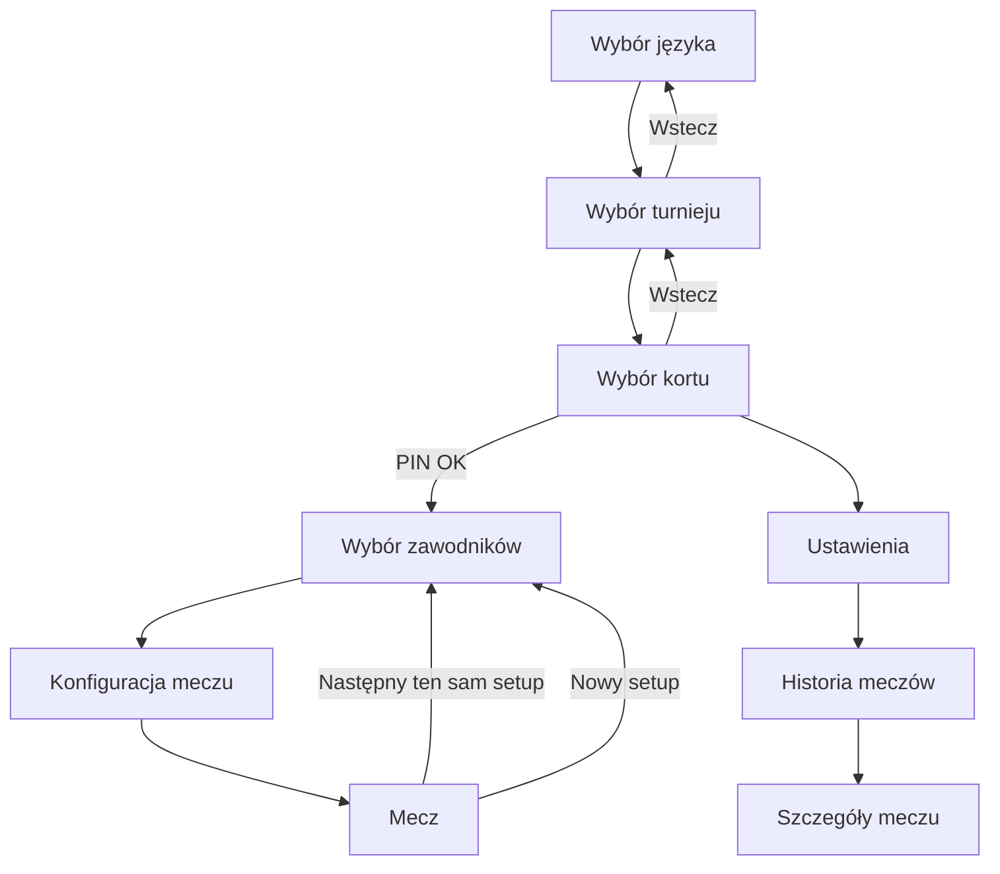

# Przepływ nawigacji

## Skrót przejść

| Z | Do | Jak |
|---|-----|-----|
| Start aplikacji | Język lub Turniej | Skip języka, jeśli już wybrany |
| Turniej | Korty | Stuknięcie turnieju |
| Kort | PIN → Zawodnicy | PIN 4 cyfry |
| Zawodnicy | Konfiguracja → Mecz | **Dalej** lub auto po pełnym wyborze |
| Mecz | Zawodnicy | Po zakończeniu: ten sam / nowy setup |
| Korty | Ustawienia | Menu (zębatka) |
| Ustawienia | Historia | Karta Historii meczów |

## Powiązane

- [[01 - Szybki start]]
- [[00 - Aplikacja sędziowska]]
